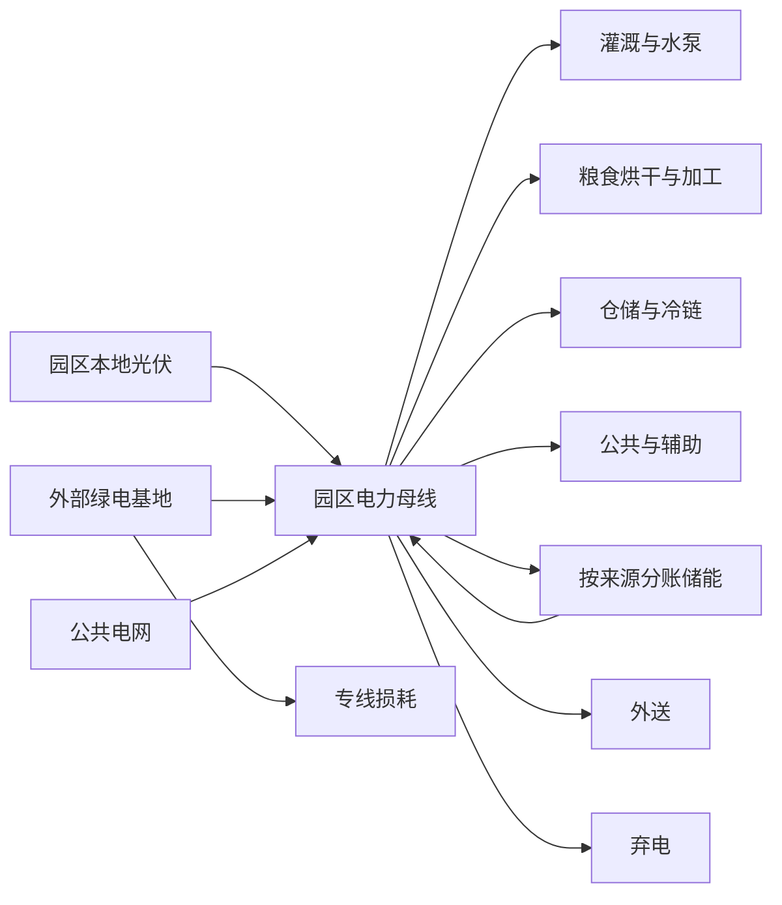

# 第一阶段农业零碳园区物理能量流模型

## 1. 实现目标

本步骤把绿电直连从年度成本后处理升级为逐时物理供电过程。每个时间点同时记录本地光伏、绿电基地注入、专线损耗、送达园区电量、公共电网购电、四类农业负荷、储能充放电、外送、弃电和碳排放。

当前采用优先级规则验证物理口径；下一步骤在同一变量和守恒关系上增加优化决策。

## 2. 演示配置

| 参数 | 当前演示值 | 来源状态 |
|---|---:|---|
| 本地光伏容量 | 1.50兆瓦 | E级演示假设 |
| 绿电直连合同容量 | 1.00兆瓦 | E级演示假设 |
| 绿电直连参考通道 | 5.00兆瓦 | E级演示假设 |
| 专线损耗率 | 3.5% | E级演示假设 |
| 储能功率 | 0.80兆瓦 | E级演示假设 |
| 储能容量 | 2.00兆瓦时 | E级演示假设 |
| 充电/放电效率 | 95%/95% | E级演示假设 |
| 荷电状态范围 | 10%—90% | E级演示假设 |
| 初始荷电状态 | 10% | 为避免年初免费可用电量而采用的保守演示设置 |
| 外送容量 | 0.50兆瓦 | E级演示假设 |

这些值只是用来证明能量流计算正确，不是优化推荐容量。

## 3. 调度顺序

每个时间间隔执行：

1. 园区本地光伏优先供应当期农业负荷。
2. 扣除线路损耗后的直连绿电供应剩余负荷。
3. 负荷仍有缺口时，储能在功率和荷电状态范围内放电。
4. 剩余缺口由公共电网供给。
5. 光伏和直连绿电剩余时，优先给储能充电。
6. 储能不能继续吸收时，在外送容量内外送。
7. 最终剩余记为弃电。

该规则不允许同一时段储能同时充放电，也不安排普通电网给储能充电。下一步优化模型可以允许低谷电充电，但必须继续保留普通电来源账户。

## 4. 能量守恒

园区电力母线满足：

`光伏 + 直连送达 + 电网购电 + 储能放电 = 农业负荷 + 储能充电 + 外送 + 弃电`

包含设备状态和损耗后的系统守恒为：

`光伏 + 直连注入 + 电网购电 = 农业负荷 + 外送 + 弃电 + 专线损耗 + 储能损耗 + 储能存量变化`

当前全年最大母线平衡误差和系统平衡误差均小于`1×10^-9`兆瓦。

## 5. 储能来源分账

储能内部建立三个独立账户：

- 本地光伏来源存量。
- 直连绿电来源存量。
- 普通电网或初始未核验来源存量。

充电时按实际来源增加对应存量，放电时按三个账户现有存量比例扣减。充放电效率损耗单独记录。只有光伏和直连来源的放电才计入物理绿电。

## 6. 四类负荷流向

每个时刻的光伏直供、直连直供、三类来源储能放电和公共电网购电，按照四类负荷当期占比分配到：

- 灌溉与水泵。
- 粮食烘干与加工。
- 仓储与冷链。
- 公共与辅助。

年度流向表由逐时分配结果求和生成，不使用固定年度比例。

## 7. 演示基准结果

| 指标 | 当前结果 |
|---|---:|
| 年用电量 | 8902.36兆瓦时 |
| 本地光伏发电 | 2814.96兆瓦时 |
| 绿电基地注入 | 4444.55兆瓦时 |
| 直连线路损耗 | 155.56兆瓦时 |
| 直连送达电量 | 4288.99兆瓦时 |
| 公共电网购电 | 2256.27兆瓦时 |
| 物理绿电供给负荷 | 6645.89兆瓦时 |
| 物理绿电匹配率 | 74.65% |
| 外送电量 | 330.20兆瓦时 |
| 弃电量 | 84.29兆瓦时 |
| 储能充电/放电 | 444.60/401.22兆瓦时 |
| 储能损耗 | 43.35兆瓦时 |
| 运营碳排放 | 1241.06吨二氧化碳 |

结果没有被强制做成100%绿电：当前演示配置仍需公共电网购电，因此只能作为低碳基准，不能显示零碳达标。

## 8. 能量流结构

## 9. 后续接口

逐时结果和年度流向表由`src/application/agri_energy_flow_service.py`生成。下一步优化模型直接复用负荷、可用出力、线路损耗、储能状态和来源分账字段，决定最优容量和运行策略。
